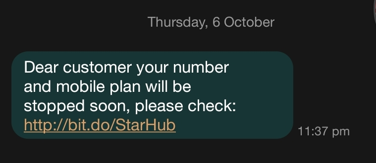
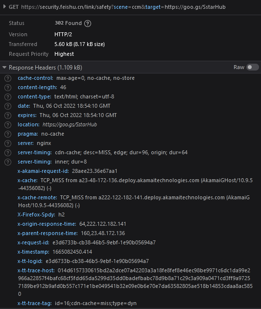
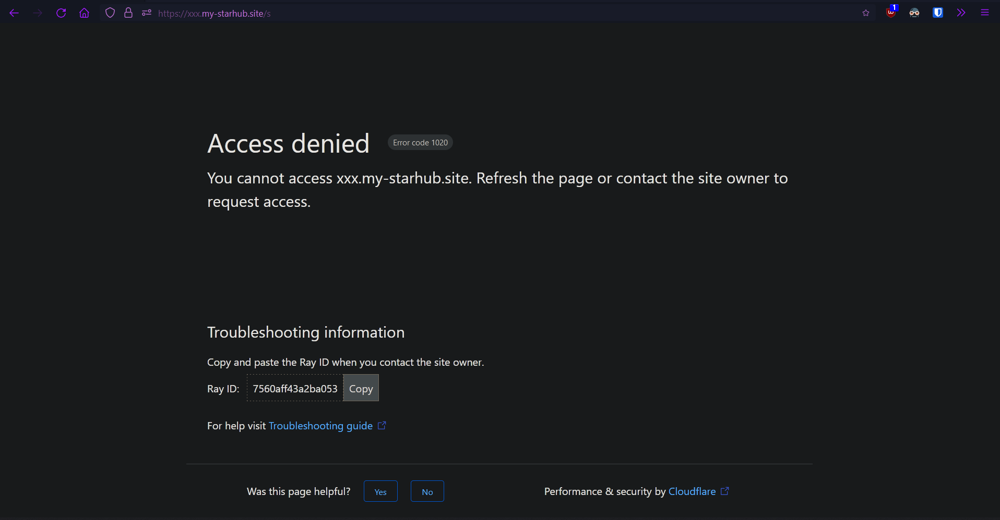
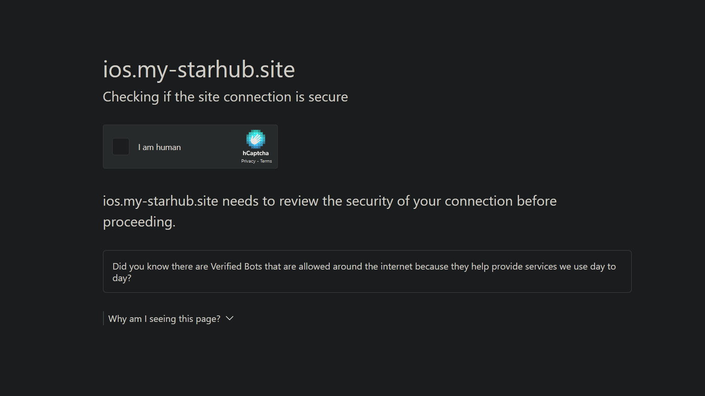
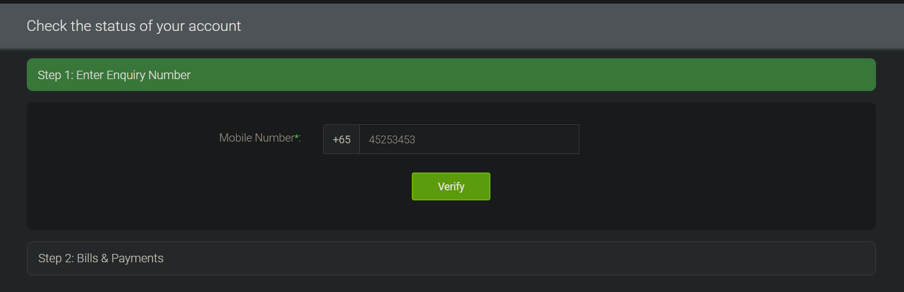
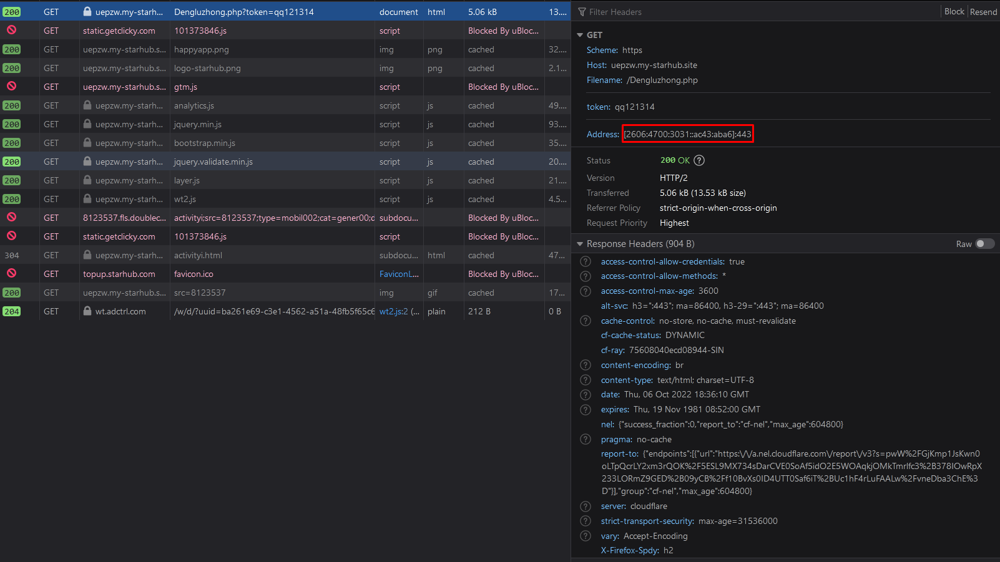
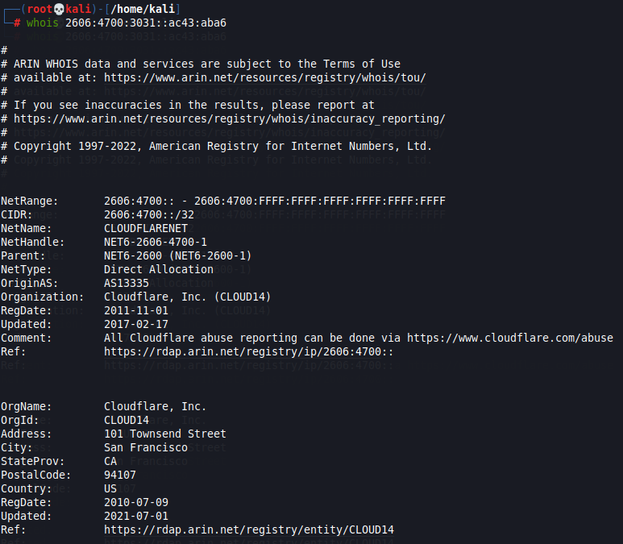
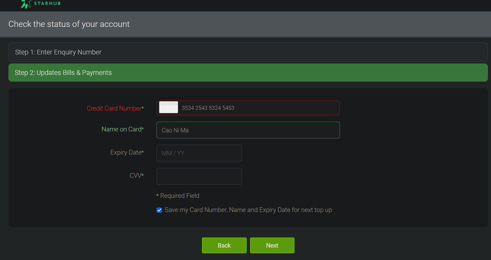
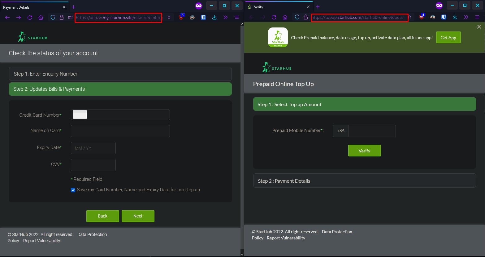

# Quick investigation on starhub phishing site

So I got this SMS, it's obvious that it's a phishing attempt but let's look at it just for fun.



URL shortner ```it.do/StarHub``` (never click on these things, espically if it's a random SMS)



Another redirect, checks user agent, redirect to real starhub site if it's desktop browser ```https://security.feishu.cn/link/safety?scene=ccm&target=https%3A%2F%2Fgoo.gs%2FSstarHub```



Clooudflare protection, blocks connection if it's desktop browser, & blocks non SG IP. Redirects to ```https://xxxx.my-starhub.site/s``` for android and ```https://ios.my-starhub.site/s``` for iphone.


Dynamic URL, with a token at the at end, not sure what it does but it doesn't change from what I can see. ```https://uepzw.my-starhub.site/Dengluzhong.php?token=qq121314``` where ```uepzw``` is a random string for each new instance. I had to change my browser user agent to get here.


Entering any number will lead to the next page.





The website's source code is actually hosted on cloudflare ```2606:4700:3031::ac43:aba6```



It actually checks for card number validity.



Weirdly when clicking on the starhub icon, it goes to the real top up page ```https://topup.starhub.com/starhub-onlinetopup/web/verify.htm``` did they steal the CSS from the real site?

Would've love to find the real IP but it seems like Cloudflare is helping the scammer. And can't scrape or nmap the site because of cloudflare.

Anyways, good job Deng Lu Zhong, I hope your site gets shut down soon. Grabbed the source code from the website, they're in this repo.
